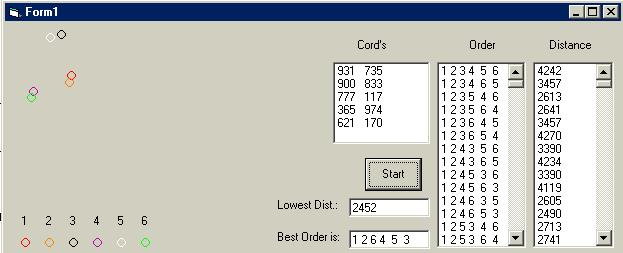



## Traveling Salesman

### Description

The Traveling Salesman is a famous math problem that does not have a easy way to be solved. The method used here is brute force, which is the WRONG way to attempt to solve any problem like this when n is a very large number.
 
### More Info
 

             |
---                |---
**Submitted On**   |2002-09-29 12:44:44
**By**             |[VB\_pro\_yo](https://github.com/Planet-Source-Code/PSCIndex/blob/master/ByAuthor/vb-pro-yo.md)
**Level**          |Intermediate
**User Rating**    |5.0 (10 globes from 2 users)
**Compatibility**  |VB 3\.0, VB 4\.0 \(32\-bit\), VB 5\.0, VB 6\.0
**Category**       |[Math/ Dates](https://github.com/Planet-Source-Code/PSCIndex/blob/master/ByCategory/math-dates__1-37.md)
**World**          |[Visual Basic](https://github.com/Planet-Source-Code/PSCIndex/blob/master/ByWorld/visual-basic.md)
**Archive File**   |[Traveling\_1380669292002\.zip](https://github.com/Planet-Source-Code/vb-pro-yo-traveling-salesman__1-39370/archive/master.zip)

